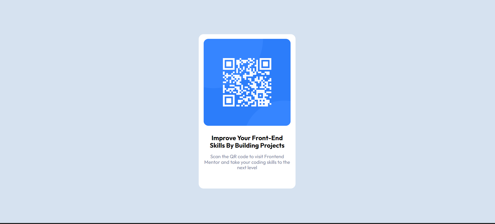

# Frontend Mentor - QR code component solution

This is a solution to the [QR code component challenge on Frontend Mentor](https://www.frontendmentor.io/challenges/qr-code-component-iux_sIO_H). Frontend Mentor challenges help you improve your coding skills by building realistic projects. 

## Table of contents

- [Overview](#overview)
  - [Screenshot](#screenshot)
  - [Links](#links)
- [My process](#my-process)
  - [Built with](#built-with)
- [Author](#author)

## Overview

### Screenshot

### Links

- Solution URL: [solution URL ](https://www.frontendmentor.io/solutions/responsiveqrcode-using-html-and-css-gQqJV93eDN)
- Live Site URL: [live site URL ](https://eldon6219.github.io/responsive-qr-code-using-html-and-css/)

## My process

### Built with

- Semantic HTML5 markup
- CSS custom properties
- Mobile-first workflow

## Author

- Frontend Mentor - [@yourusername](https://www.frontendmentor.io/profile/eldon6219)
- linked in - (https://www.linkedin.com/in/m-eldon-96b195229/)

